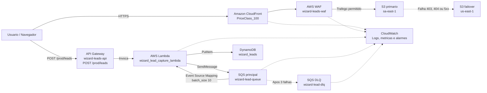

# Wizard Resilience

## Dossie tecnico do Hackathon

Arquitetura AWS para uma presenca digital resiliente, protegida e capaz de absorver picos de captura de leads sem perder mensagens durante indisponibilidades temporarias do processamento.

## Objetivo

Manter o site publico disponivel sob falha da origem e proteger a captura de leads contra picos, erros de processamento e mensagens que nao possam ser persistidas.

O projeto usa exclusivamente servicos AWS provisionados com Terraform.

## Arquitetura atual



### Fluxo de leads

1. O formulario envia um `POST /prod/leads` para o API Gateway.
2. A Lambda valida os campos e publica o lead na fila SQS.
3. O API responde `201` depois que a mensagem foi aceita pela SQS.
4. O Event Source Mapping dispara a mesma Lambda para consumir a mensagem.
5. A Lambda persiste o lead no DynamoDB.
6. Se o processamento falhar, a excecao e relancada para que a SQS tente novamente.
7. Depois de 3 tentativas, a mensagem e movida para `wizard-lead-dlq`.

A mesma funcao Lambda tem dois modos de entrada: evento HTTP do API Gateway e evento de lote da SQS. Isso reduz infraestrutura e custo para o MVP, mantendo o desacoplamento entre recebimento e persistencia.

## Componentes provisionados

| Camada | Servicos e recursos |
|---|---|
| Entrega | S3 em `sa-east-1`, S3 em `us-east-1`, CloudFront com OAC e Origin Group |
| Seguranca | AWS WAF para CloudFront, regra gerenciada Common Rule Set e rate limit por IP |
| API | API Gateway REST, `POST /prod/leads`, `OPTIONS /prod/leads` e permissao para Lambda |
| Computacao | Lambda `wizard_lead_capture_lambda` em Python 3.9 |
| Desacoplamento | SQS `wizard-lead-queue`, long polling, retenção de 14 dias e DLQ |
| Persistencia | DynamoDB `wizard_leads` com `PAY_PER_REQUEST` |
| Observabilidade | CloudWatch Logs, metricas nativas e 3 alarmes |
| IaC | Terraform modularizado |

## Pilares do briefing

### Pilar 1: Entrega estatica global e cache de borda

**Atendido para o MVP.**

- Site estatico armazenado em S3.
- CloudFront distribuindo o conteudo globalmente.
- Origin Access Control com assinatura SigV4.
- HTTPS pelo certificado padrao do CloudFront.
- Cache gerenciado `CachingOptimized`.
- `PriceClass_100`, escolhido para reduzir custo.

**Evidencia recomendada:** mostrar a distribuicao no console CloudFront, o cabecalho `x-cache: Hit from cloudfront` e o grafico de Cache Hit Rate.

O briefing recomenda dominio proprio, Route 53 e ACM, mas nao os torna obrigatorios. O MVP utiliza o dominio `cloudfront.net`.

### Pilar 2: Defesa de borda e seguranca de aplicacao

**Atendido.**

- Web ACL `wizard-leads-waf` associada ao CloudFront.
- Regra gerenciada `AWSManagedRulesCommonRuleSet`.
- Rate-based rule de 100 requisicoes por IP.
- Logs do WAF enviados para CloudWatch.
- Shield Standard incluido automaticamente na protecao do CloudFront.

**Evidencia recomendada:** gerar requisicoes de teste controladas, mostrar a metrica da regra e consultar os logs do WAF no CloudWatch.

### Pilar 3: Alta disponibilidade e failover automatico

**Atendido parcialmente, com mecanismo funcional para demonstracao.**

- Bucket primario em `sa-east-1`.
- Bucket secundario em `us-east-1`.
- CloudFront Origin Group.
- Failover para status `403`, `404`, `500`, `502`, `503` e `504`.

O projeto **nao implementa atualmente** S3 Cross-Region Replication nem Route 53 Health Checks. Os dois buckets recebem o `index.html` pelo deploy Terraform, mas nao sao sincronizados automaticamente depois disso.

**Evidencia recomendada:** remover temporariamente o objeto da origem primaria, invalidar o cache e mostrar a pagina sendo entregue pela origem secundaria. Medir o tempo entre a falha e a resposta da contingencia para registrar o RTO.

### Pilar 4: Captura resiliente de leads

**Atendido e e o principal diferencial do projeto.**

- API Gateway recebe o lead.
- Lambda publica a mensagem na SQS.
- SQS absorve picos e desacopla entrada de processamento.
- Event Source Mapping consome lotes de ate 10 mensagens.
- Lambda persiste no DynamoDB.
- DLQ retém mensagens que falharam 3 vezes.
- Mensagens podem ser reprocessadas a partir da DLQ.

Esse desenho evita que uma indisponibilidade temporaria do DynamoDB ou do processamento descarte imediatamente o lead que ja foi aceito pela API.

O briefing cita EventBridge como servico de referencia, mas ele nao e obrigatorio. SQS e DLQ atendem diretamente ao requisito de absorcao, retry e retencao.

### Pilar 5: Identidade, segredos e governanca

**Atendido parcialmente.**

- Role IAM para Lambda.
- Permissoes para DynamoDB, SQS e CloudWatch Logs.
- Nenhuma chave ou segredo de aplicacao versionado no codigo.
- Buckets S3 com bloqueio de acesso publico e acesso via OAC.

Para uma evolucao de producao, recomenda-se separar as roles de produtor e consumidor e adicionar Secrets Manager ou SSM Parameter Store, KMS, CloudTrail, GuardDuty e Security Hub.

### Pilar 6: Chaos Engineering e prova de carga

**Atendido parcialmente.**

- O ambiente permite testes controlados de falha da origem, fila e processamento.
- O WAF possui metricas e logs para demonstracao de bloqueio.
- O fluxo de carga pode ser observado no CloudWatch e no DynamoDB.

Ainda nao foram provisionados FIS, CloudWatch Synthetics ou Distributed Load Testing como recursos Terraform. O dossie deve registrar o cenario, horario, resultado, RTO e evidencias do Game Day.

### Pilar 7: Reprodutibilidade e controle de custo

**Atendido parcialmente.**

- Infraestrutura modular e recriavel com Terraform.
- DynamoDB em modo `PAY_PER_REQUEST`.
- SQS sem capacidade provisionada.
- CloudFront em `PriceClass_100`.
- Alarmes CloudWatch provisionados por codigo.

Ainda faltam AWS Budgets, estimativa formal de custo e pipeline CodePipeline/CodeBuild. O custo exato depende principalmente de trafego, requisicoes CloudFront/WAF, armazenamento S3 e volume de mensagens.

## Observabilidade e alarmes

Os alarmes atuais sao funcionais sem SNS. Eles mudam de estado no CloudWatch quando a metrica ultrapassa o limite:

| Alarme | Metrica | Condicao |
|---|---|---|
| `wizard-lead-lambda-errors` | `AWS/Lambda - Errors` | Pelo menos 1 erro em 5 minutos |
| `wizard-lead-dlq-messages` | `AWS/SQS - ApproximateNumberOfMessagesVisible` | Mais de 0 mensagens na DLQ |
| `wizard-lead-queue-oldest-message` | `AWS/SQS - ApproximateAgeOfOldestMessage` | Mensagem mais antiga acima de 300 segundos |

SNS **nao e necessario para os alarmes funcionarem**. Ele seria necessario apenas para enviar notificacoes por e-mail, SMS ou outro destino.

### Logs produzidos pela Lambda

A Lambda registra eventos de negocio para facilitar a leitura no CloudWatch:

```text
Lead enfileirado com sucesso: <leadId>
Lead processado com sucesso: <leadId>
```

Para uma evidencia mais executiva, o proximo refinamento pode registrar tambem nome e curso, sem expor telefone ou e-mail completo nos logs:

```python
logger.info(
    "Lead processado: leadId=%s nome=%s curso=%s",
    lead["leadId"],
    lead["name"],
    lead["course"],
)
```

## Testes e evidencias

### 1. Validar a infraestrutura

Na pasta `terraform`:

```powershell
terraform fmt -check -recursive
terraform validate
terraform plan
```

### 2. Gerar o pacote da Lambda

Na raiz do projeto:

```powershell
python src/scripts/build_lambdas.py lead_capture
```

O pacote gerado e `dist/lead_capture.zip`.

### 3. Verificar filas

```powershell
aws sqs list-queues --queue-name-prefix wizard-lead --region us-east-1
```

Esperado:

```text
wizard-lead-queue
wizard-lead-dlq
```

### 4. Testar o fluxo API Gateway -> Lambda -> SQS -> DynamoDB

Obter a URL da API:

```powershell
$apiUrl = terraform output -raw api_invoke_url
$apiUrl
```

Enviar um lead valido:

```powershell
$body = @{
  name = "Maria Silva"
  email = "maria@example.com"
  phone = "11999999999"
  course = "AWS"
} | ConvertTo-Json -Compress

Invoke-RestMethod `
  -Method Post `
  -Uri "$apiUrl/leads" `
  -ContentType "application/json" `
  -Body $body
```

Esperado: resposta HTTP `201`. A mensagem pode desaparecer rapidamente da SQS porque a Lambda consumidora e acionada automaticamente.

Ver logs em tempo real:

```powershell
aws logs tail /aws/lambda/wizard_lead_capture_lambda --follow --region us-east-1
```

### 5. Testar diretamente a fila

```powershell
$queueUrl = terraform output -raw leads_queue_url

$message = '{"leadId":"teste-terminal-001","name":"Maria Silva","email":"maria@example.com","phone":"11999999999","course":"AWS","createdAt":"2026-09-02T20:30:00Z"}'

aws sqs send-message `
  --queue-url $queueUrl `
  --message-body $message `
  --region us-east-1
```

Depois confirme o log `Lead processado com sucesso` e o item no DynamoDB `wizard_leads`.

### 6. Testar a DLQ

Envie uma mensagem sem os campos obrigatorios de persistencia:

```powershell
$invalidMessage = '{"name":"Mensagem invalida"}'

aws sqs send-message `
  --queue-url $queueUrl `
  --message-body $invalidMessage `
  --region us-east-1
```

A Lambda deve falhar, a SQS deve tentar novamente e, depois de 3 recebimentos, mover a mensagem para `wizard-lead-dlq`.

Consultar a DLQ:

```powershell
$dlqUrl = aws sqs get-queue-url `
  --queue-name wizard-lead-dlq `
  --region us-east-1 `
  --query QueueUrl `
  --output text

aws sqs receive-message `
  --queue-url $dlqUrl `
  --wait-time-seconds 10 `
  --region us-east-1
```

### 7. Testar o failover do site

1. Confirme que os dois buckets possuem o mesmo `index.html`.
2. Acesse a distribuicao pelo dominio CloudFront.
3. Remova temporariamente `index.html` apenas do bucket primario.
4. Crie uma invalidacao de cache para `/*`.
5. Acesse novamente a distribuicao.
6. Registre o horario da falha e o horario da resposta pela origem secundaria.
7. Restaure o arquivo no bucket primario.

Nao execute esse teste em ambiente de clientes. Use somente os recursos do hackathon.

## Runbook de incidente

### Leads nao aparecem no DynamoDB

1. Consultar `/aws/lambda/wizard_lead_capture_lambda`.
2. Verificar o alarme `wizard-lead-lambda-errors`.
3. Verificar mensagens disponiveis e em transito na SQS.
4. Consultar `wizard-lead-dlq`.
5. Corrigir a causa e reprocessar as mensagens da DLQ.

### Mensagens na DLQ

1. Nao apagar a DLQ.
2. Consultar a mensagem e o erro nos logs.
3. Corrigir o problema de codigo, permissao ou dado.
4. Reenviar a mensagem para `wizard-lead-queue`.
5. Confirmar a persistencia no DynamoDB.

### Site indisponivel

1. Verificar o estado da distribuicao CloudFront.
2. Consultar logs e metricas do WAF.
3. Verificar o objeto no bucket primario.
4. Validar o objeto no bucket secundario.
5. Invalidar o cache somente quando necessario.
6. Registrar RTO e resultado do failover.

## Diferenciais para o pitch

- O lead recebe uma resposta rapida porque a entrada e desacoplada da persistencia.
- A SQS absorve picos e evita perda imediata durante falhas temporarias.
- A DLQ transforma falhas invisiveis em mensagens retidas e reprocessaveis.
- O CloudFront continua servindo o site por uma segunda origem quando a primaria falha.
- O WAF combina regra gerenciada e rate limiting por IP.
- CloudWatch transforma erros, idade de fila e DLQ em sinais operacionais.
- O ambiente e reproduzivel por Terraform e usa servicos serverless com custo variavel.
- `PriceClass_100` e DynamoDB `PAY_PER_REQUEST` mantem o MVP economico.

## Limites conhecidos

- Nao ha S3 Cross-Region Replication: a sincronizacao dos buckets ocorre no deploy Terraform.
- Nao ha Route 53 Health Check, dominio proprio ou ACM.
- Nao ha DynamoDB Global Tables.
- Nao ha SNS para notificacao externa.
- Nao ha FIS, Synthetics ou pipeline CI/CD provisionados.
- A role IAM e compartilhada pela Lambda produtora e consumidora no MVP.
- Os alarmes aparecem no CloudWatch, mas nao enviam e-mail sem uma acao SNS.

Esses limites devem ser apresentados como decisoes de escopo e evolucoes futuras, sem declarar que esses servicos ja estao implementados.

## Teardown

Ao final do hackathon, revisar mensagens e evidencias antes de destruir os recursos:

```powershell
cd terraform
terraform plan -destroy
terraform destroy
```

Atenção: `force_destroy = true` nos buckets permite apagar objetos junto com os buckets. Execute o teardown somente na conta e ambiente do hackathon.
